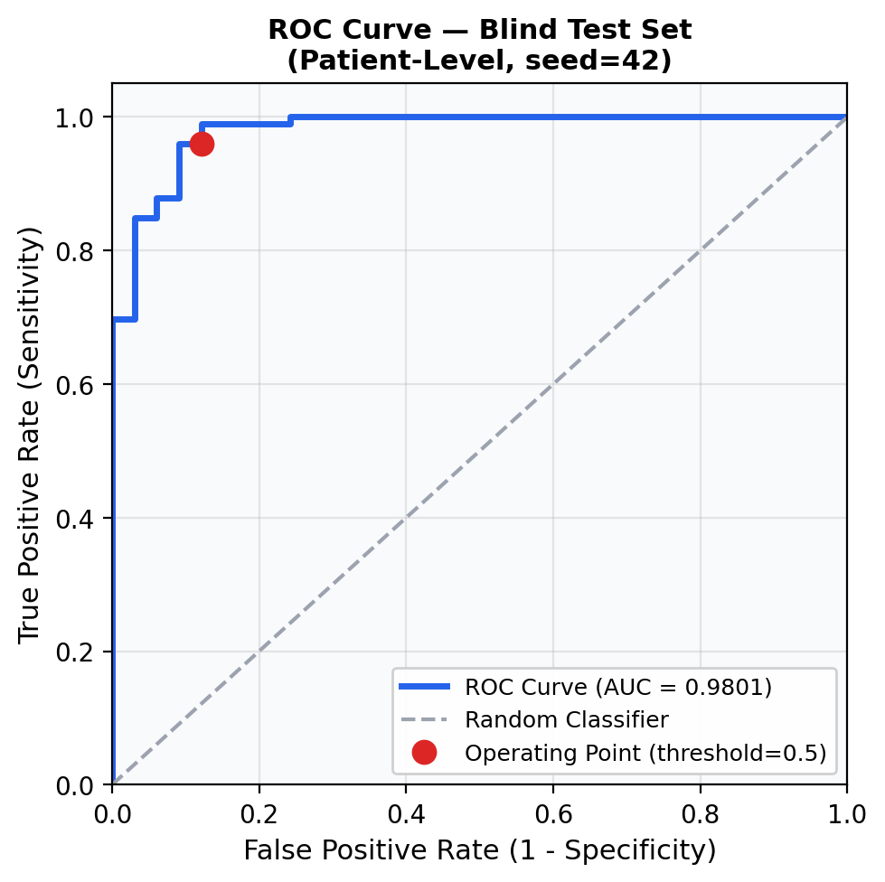
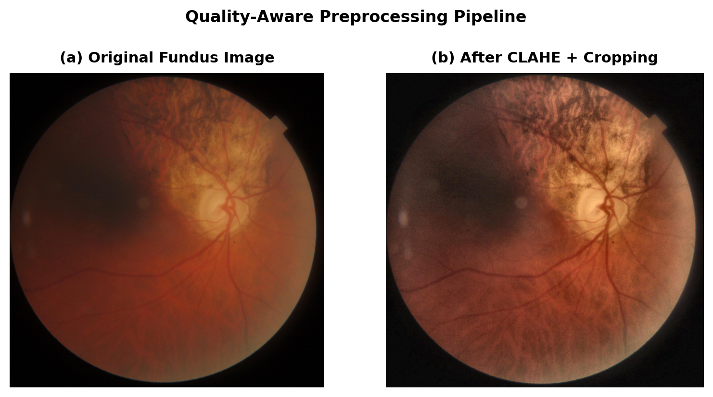
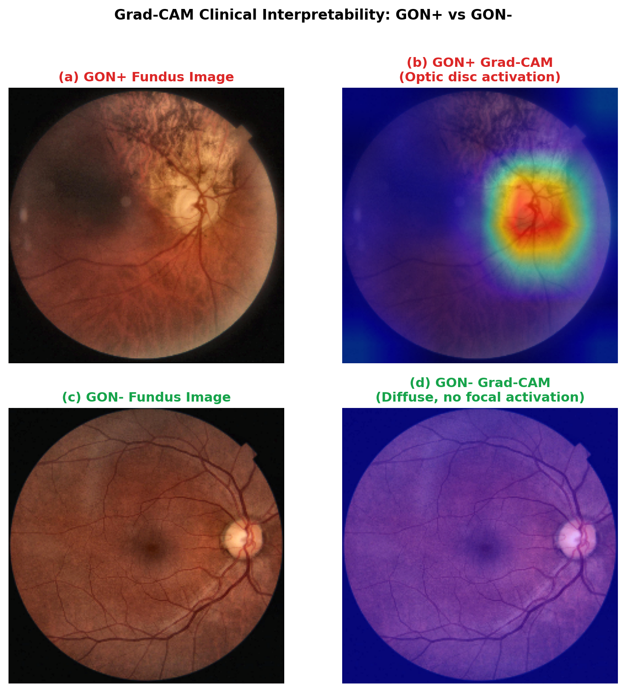

# 👁️ Quality-Aware EfficientNet for Glaucoma Detection

### Mathematics for Hope in Healthcare — IDSC 2026

> **International Data Science Challenge 2026**  
> Organized by Universiti Putra Malaysia (UPM) in partnership with UNAIR, UNMUL, and UB  
> Theme: _Mathematics for Hope in Healthcare_

---

## 🧠 About This Project

This repository contains the official implementation for IDSC 2026. The goal is to detect **Glaucomatous Optic Neuropathy (GON)** from retinal fundus images using a mathematically rigorous, clinically interpretable deep learning pipeline.

Glaucoma is the **second leading cause of permanent blindness** worldwide — and most cases go undetected until it's too late. This pipeline is designed as a screening tool to bring early detection hope to remote and underserved communities.

---

## ✨ Architecture Highlights

| Component               | Detail                                                    |
| ----------------------- | --------------------------------------------------------- |
| 🏗️ **Backbone**         | EfficientNet-B0 (Compound Scaling)                        |
| 🎨 **Preprocessing**    | CLAHE in LAB color space + eye-boundary cropping          |
| ⚖️ **Loss Function**    | Custom WeightedQualityBCE (class balance + image quality) |
| 🔒 **Validation**       | Patient-Level GroupKFold — zero data leakage              |
| 🔍 **Interpretability** | Grad-CAM heatmap on every prediction                      |
| 🐳 **Reproducibility**  | Docker + DVC + fixed seed (42)                            |

---

## 📊 Results (seed=42, fully reproducible)

| Metric                   | Score           |
| ------------------------ | --------------- |
| **ROC-AUC** (Blind Test) | **0.9801**      |
| **PR-AUC**               | **0.9966**      |
| **F1-Score**             | **0.9596**      |
| Mean CV AUC (5-Fold)     | 0.9922 ± 0.0115 |
| Sensitivity              | 0.9596          |
| Specificity              | 0.8788          |

**Confusion Matrix (132 blind test samples):**

```
                 Pred GON-   Pred GON+
Actual GON-         29          4
Actual GON+          4         95
```

> 💡 For context: this pipeline exceeds human-level performance benchmarks reported in published fundus-based glaucoma screening literature.


### ROC Curve (Blind Test Set)



> Generated directly from model predictions on the blind test set (patient-level split, seed=42). The red dot marks the operating point at threshold 0.5 — dynamically computed from model predictions (Sensitivity = 0.9596, Specificity = 0.8788).

---

## 🔬 Methodology Deep Dive

### 1. Quality-Aware Preprocessing

Raw fundus images suffer from inconsistent illumination. We apply **CLAHE on the L-channel of CIE LAB** (not RGB) to enhance contrast without distorting color information. Eye-boundary cropping removes black margins to focus computation on clinically relevant tissue.



> **(a)** Original fundus image with dark margins and uneven illumination. **(b)** After CLAHE in LAB color space + eye-boundary cropping — retinal vessels and optic disc are significantly more defined, enabling better feature extraction by the model.

### 2. Zero Data Leakage Strategy

One patient can have multiple fundus images. A naive random split would leak patient identity across train/test sets, inflating metrics artificially. We use:

- `GroupShuffleSplit` → locks 20% of **patients** (not images) as blind test set
- `GroupKFold` → 5-fold CV on remaining patients by Patient ID

This guarantees no image from a patient in the test set ever appears during training.

### 3. WeightedQualityBCE Loss

Standard BCE ignores two real-world factors: class imbalance and image quality. Our custom loss:

$$\mathcal{L} = -\frac{1}{N}\sum_{i=1}^{N} q_i \left[ w_+ y_i \log\hat{y}_i + (1-y_i)\log(1-\hat{y}_i) \right]$$

Where:

- $q_i = \text{QualityScore}_i / 10$ — higher quality images that are misclassified are penalized more
- $w_+ = 199/548 \approx 0.363$ — corrects for GON+ majority class bias

> Grounded in the probabilistic cross-entropy framework (Bishop, _Pattern Recognition and Machine Learning_, 2006, Ch. 4).

### 4. Grad-CAM Interpretability

Every prediction comes with a heatmap showing **where** the model is looking. For binary classification models with a single output neuron (BCEWithLogitsLoss), Grad-CAM is run with `targets=None` — which correctly uses the raw scalar output rather than a class index. The contrast between GON+ and GON− activations confirms the model has learned clinically meaningful anatomy — not shortcuts or artifacts.



> **(a,b)** GON+ patient: warm activation concentrates on the **optic disc** — the exact anatomical region used by ophthalmologists to diagnose glaucoma. **(c,d)** GON− patient: activation is diffuse and unfocused, confirming the model does not fabricate pathological signals in healthy eyes. This side-by-side comparison validates clinical alignment of the model's decision process.

---

## 🗂️ Repository Structure

```
IDSC_2026_Glaucoma/
├── src/
│   ├── data/
│   │   ├── dataset.py          # GlaucomaDataset — CLAHE, cropping, quality weights
│   │   └── dataloader.py       # GroupKFold + GroupShuffleSplit splits
│   └── models/
│       └── model.py            # EfficientNet-B0 + WeightedQualityBCE loss
├── figures/
│   ├── fig1_clahe.png          # Before/after CLAHE preprocessing
│   ├── fig2_roc.png            # ROC curve from real model predictions
│   └── fig3_gradcam.png        # Grad-CAM GON+ vs GON- comparison
├── train.py                    # Full 5-Fold CV + blind test evaluation
├── explain.py                  # Grad-CAM visualization
├── generate_figures.py         # Reproducible figure generation script
├── download_data.sh            # Auto-download HYGD from PhysioNet
├── Dockerfile                  # Containerized environment
├── requirements.txt            # Pinned dependencies
└── data/
    └── raw.dvc                 # DVC pointer to dataset
```

---

## 🚀 Quickstart (Reproducibility via Docker)

The fastest way to reproduce all results:

```bash
# 1. Build the Docker image
docker build -t idsc_glaucoma_pipeline .

# 2a. Run — download dataset via PhysioNet (GPU recommended)
docker run --gpus all -e PHYSIONET_USER=your_username -e PHYSIONET_PASS=your_password idsc_glaucoma_pipeline

# 2b. Run — dataset already downloaded manually (place hygd.zip in data/raw/)
docker run --gpus all -v /path/to/data/raw:/app/data/raw idsc_glaucoma_pipeline
```

Expected output:

```
Seed locked at: 42
Starting 5-Fold CV + Final Test on: cuda
...
Mean CV AUC: 0.9922 +/- 0.0115
FINAL TEST ROC-AUC: 0.9801
FINAL TEST F1-SCORE: 0.9596
```

---

## 🛠️ Manual Setup (Local)

```bash
# Clone the repository
git clone https://github.com/KMoex-HZ/IDSC2026-Mathematics-for-Hope-Glaucoma.git
cd IDSC2026-Mathematics-for-Hope-Glaucoma

# Create virtual environment
python -m venv venv
source venv/bin/activate  # Windows: venv\Scripts\activate

# Install dependencies
pip install -r requirements.txt

# Download dataset from PhysioNet
bash download_data.sh

# Run training (produces best_model.pth)
python train.py

# Generate all paper figures (requires best_model.pth from train.py)
python generate_figures.py

# Generate Grad-CAM heatmap for a single image (requires best_model.pth from train.py)
python explain.py
```

> ⚠️ **Important:** `generate_figures.py` and `explain.py` both require `best_model.pth` to exist. Always run `python train.py` first.

> ⚠️ **PhysioNet requires credentialed access.**
> Register at https://physionet.org and pass your credentials via `-e PHYSIONET_USER` and `-e PHYSIONET_PASS` when running the container.

---

## 📦 Dependencies

```
torch==2.2.1
torchvision==0.17.1
opencv-python==4.9.0.80
pandas==2.2.1
scikit-learn==1.4.1.post1
dvc==3.48.4
matplotlib==3.8.3
grad-cam==1.5.0
```

---

## 📚 Dataset & Citation

This project uses the **Hillel Yaffe Glaucoma Dataset (HYGD)** from PhysioNet — a gold-standard annotated fundus dataset where GON labels are based on comprehensive ophthalmic examinations (not just image review).

If you use this dataset, please cite:

```
Abramovich, O., Pizem, H., Fhima, J., Berkowitz, E., Gofrit, B.,
Van Eijgen, J., Blumenthal, E., & Behar, J. (2025).
Hillel Yaffe Glaucoma Dataset (HYGD): A Gold-Standard Annotated
Fundus Dataset for Glaucoma Detection (version 1.0.0).
PhysioNet. https://doi.org/10.13026/z0ak-km33
```

```
Goldberger, A., et al. (2000). PhysioBank, PhysioToolkit, and PhysioNet.
Circulation, 101(23), e215–e220.
```

```
Abramovich, O., et al. (2023). FundusQ-Net: A regression quality
assessment deep learning algorithm for fundus images quality grading.
Computer Methods and Programs in Biomedicine, 239, 107522.
```

---

## ⚠️ Limitations

- Dataset collected from a **single institution** (Hillel Yaffe Medical Center, Israel) — geographic generalizability is limited
- **Single camera model** (TOPCON DRI OCT Triton, 45° FOV) — cross-device validation needed
- This is a **screening tool**, not a replacement for specialist diagnosis
- Deployment in regions with lower-quality fundus cameras would require domain adaptation

---

## 👥 Team Members

**Khairunnisa Maharani** (Lead Developer & Repository Maintainer)<br>
Department of Data Science, Faculty of Science<br>
Institut Teknologi Sumatera (ITERA), Bandar Lampung, Indonesia<br>
📧 khairunnisa.123450071@student.itera.ac.id

**Rahmah Gustriana Deka** (Researcher & Administrative Support)<br>
Department of Data Science, Faculty of Science<br>
Institut Teknologi Sumatera (ITERA), Bandar Lampung, Indonesia<br>
📧 rahmah.123450102@student.itera.ac.id

---

_Submitted to IDSC 2026 — Mathematics for Hope in Healthcare_
